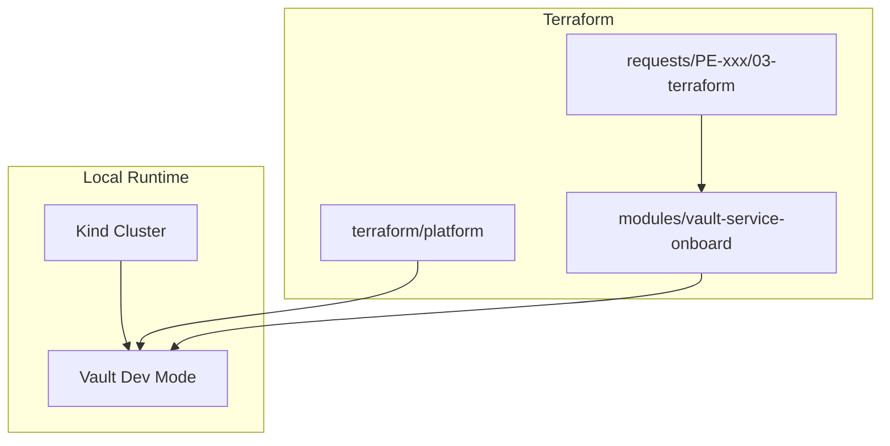

# Architecture

## Problem

Regulated platform teams need **traceable, reviewable** infrastructure delivery. Ad-hoc AI code generation bypasses approval gates and produces unauditable changes.

## Approach

This repository implements **specification-driven development (SDD)** with explicit human gates between phases. Cursor provides:

- **Rules** — enforce process (phase order, formats, conventions)
- **Skills** — deterministic procedures for each workflow step
- **MCP** — read Jira tickets, open GitHub PRs
- **Bugbot** — mandatory automated review before merge

The agent is a **copilot**, not an autonomous operator. Each phase produces a committed artifact that a human approves before the next phase begins.

## Phase model

```
requests/PE-123/
├── 01-spec/          Business/requirements review
├── 02-plan/          Technical design review
├── 03-terraform/     Code review (PR)
├── 04-validation/    SRE/evidence review
├── 05-review/        Bugbot findings
├── 06-pr/            Delivery metadata
└── 07-jira-update/   Traceability back to ticket
```

Reviewers can scope their review to a single phase without reading unrelated artifacts.

## Infrastructure layers



- **Platform layer** — applied once; configures Kubernetes auth and KV mount
- **Module** — reusable `vault-service-onboard` for any service
- **Request layer** — thin wrapper per Jira ticket with values from approved spec

## Security model

Each service receives:

1. **Vault policy** — read/list on `secret/data/teams/{team}/{service}/*` only
2. **Kubernetes auth role** — bound to `{namespace}/{service_account}`
3. **KV paths** — scaffolded under team prefix

Policies are derived from Jira ticket fields, written into the spec, reviewed in the plan, and copied verbatim into Terraform. No path invention by the agent.

## Why local-only

Interview and demo environments cannot depend on cloud accounts or enterprise licences. Kind + Vault dev mode provides sufficient fidelity to demonstrate:

- Terraform plan/apply against a real Vault API
- Kubernetes auth role binding
- Full validation pipeline

Production deployment would use the same modules with environment-specific tfvars and a hardened Vault cluster.

## Audit trail

| Artifact | Auditor question answered |
|----------|---------------------------|
| `01-spec/spec.md` | What was requested and approved? |
| `02-plan/plan.md` | How will it be implemented? |
| `04-validation/report.md` | Did `terraform plan` succeed? |
| `05-review/bugbot.md` | Were code issues identified? |
| `06-pr/metadata.json` | Where is the change under review? |
| `07-jira-update/comment.md` | Was the requester notified? |
