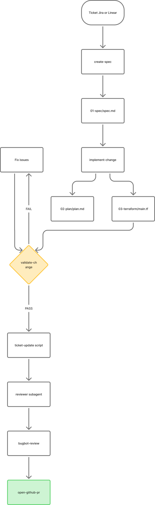

# Autonomous Delivery

Specification-driven **autonomous delivery** extends the existing manual workflow without replacing it. Use this path when you want the agent to implement and validate infrastructure changes with minimal mid-phase handoffs, while still producing auditable artifacts.

## When to use

| Use autonomous | Use manual (default) |
|----------------|----------------------|
| Well-formed tickets (Jira or Linear) with all required fields | Spec/plan need human review before code |
| Standard Vault service onboarding | Non-standard or exploratory requests |
| Local/dev environment delivery | Production-first review gates |

## Quick start (webhook)

Move a **Jira** issue to **In Progress, agents** (existing Cursor webhook) or a Linear issue to **In Progress Cursor**. A Cloud Agent follows `AGENTS.md`: golden evals, in-repo hooks, then `create-spec` → validation → draft PR. It does **not** start Grafana.

For a local observability demo, say **run the local demo** instead (laptop Grafana).

## Quick start (skills)

```
create-spec → implement-change → validate-change (loop) → reviewer → bugbot → draft PR
```

Or run validation manually:

```bash
task validate-change REQUEST=PE-123-payments-api
./scripts/ticket-update-on-validation.sh PE-123-payments-api
```

Post a Slack notification after any phase (optional):

```
notify-slack: PE-123 validation passed — ready for review
```

## Workflow diagram

[](https://www.figma.com/board/1RbIQpZgVRQr2TzsKe2SiZ)

## Validation pipeline

`task validate-change REQUEST=<id>` runs checks in order:

| Step | Tool | Required |
|------|------|----------|
| 1 | `terraform fmt -check` | Yes |
| 2 | `terraform validate` | Yes |
| 3 | `terraform test` | Module tests always; request tests if present |
| 4 | Terratest | When Vault reachable |
| 5 | `conftest test` | When `conftest` installed |
| 6 | `trivy config` | When `trivy` installed |
| 7 | `tflint` | When installed |
| 8 | `terraform plan` | When Vault reachable |

Reports are written to `requests/<id>/04-validation/report.md` with per-check `.out` files.

## Autonomous marker

Autonomous requests include `requests/<id>/01-spec/autonomous.json`:

```json
{
  "mode": "autonomous",
  "ticket_id": "PE-123",
  "ticket_provider": "jira",
  "created_at": "2026-07-28T12:00:00Z",
  "next_skill": "implement-change"
}
```

Sign-off tables record: `Autonomous delivery — auto-approved per ADR-001`.

## Reviewer subagent

Defined at `.cursor/agents/reviewer.md`:

- `readonly: true` — cannot modify files
- Isolated context — evaluates spec, plan, terraform, validation only
- Output: `requests/<id>/05-review/reviewer.md`

## Bugbot

Project rules: `.cursor/BUGBOT.md`

Local review skill: `bugbot-review` (unchanged)

## Engineering decisions

All architectural choices are documented in [engineering-decisions/](engineering-decisions/):

- [ADR-001: Autonomous delivery path](engineering-decisions/001-autonomous-delivery-path.md)
- [ADR-002: Extended validation pipeline](engineering-decisions/002-extended-validation-pipeline.md)
- [ADR-003: Readonly reviewer subagent](engineering-decisions/003-readonly-reviewer-subagent.md)
- [ADR-004: Bugbot configuration](engineering-decisions/004-bugbot-configuration.md)
- [ADR-005: Ticket update on validation](engineering-decisions/005-jira-update-on-validation.md)
- [ADR-006: Ticket provider abstraction](engineering-decisions/006-ticket-provider-abstraction.md)

## Slack notifications

The `notify-slack` skill can be combined with any phase. Three scenarios:

| Scenario | Trigger |
|----------|---------|
| Workflow notification | `notify-slack: PE-123 spec is ready for review` |
| Query pending tickets | `notify-slack: which Jira tickets are pending?` |
| Ticket creation | `notify-slack: create a Linear ticket for auth-service and confirm` |

See [docs/setup.md](../docs/setup.md#slack-optional) for Slack app setup and [`.cursor/skills/notify-slack/SKILL.md`](../../.cursor/skills/notify-slack/SKILL.md) for the full scenario reference.

