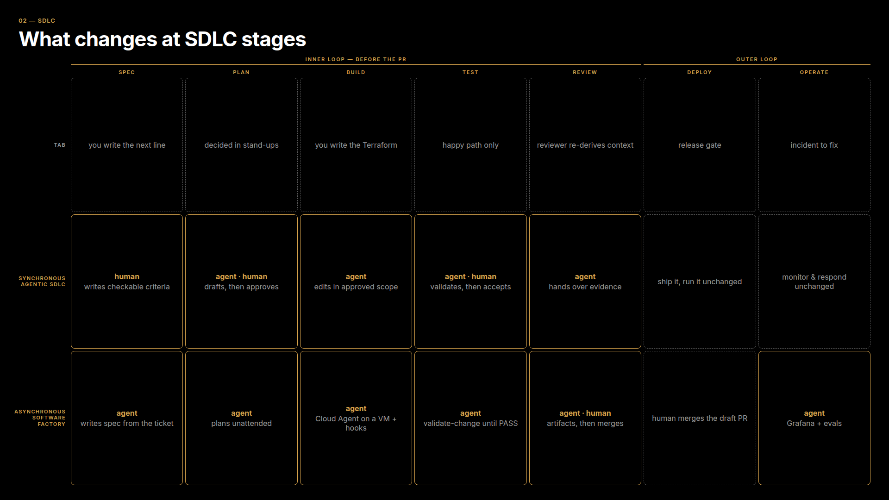
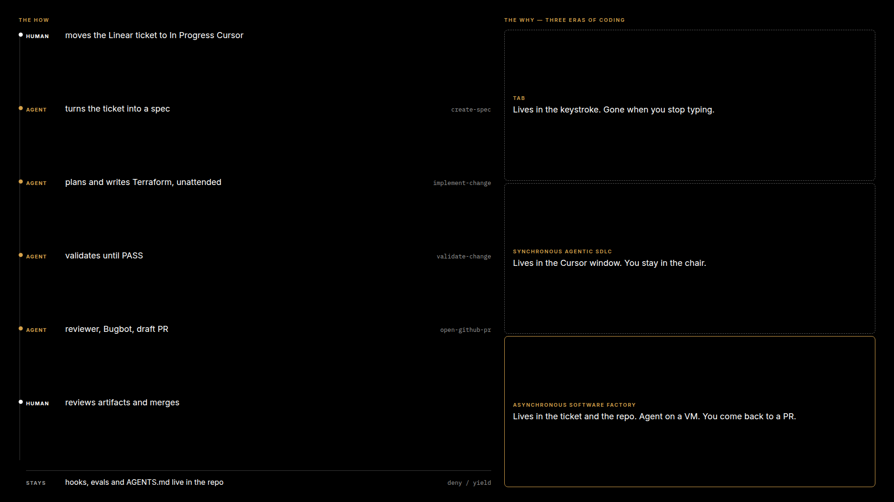

# Spec-Driven Vault Onboarding, but the agent does the whole SDLC

As I mentioned in the [previous post](https://medium.com/@pablogd/spec-driven-vault-onboarding-with-cursor-1eb95cc5aeaf), one of the things I keep coming back to in discovery sessions is onboarding. You map the process on the whiteboard ( ticket, spec, implement, review, deploy) and it takes two to three weeks, even when the actual Vault change is a policy, a Kubernetes auth role and a couple of KV paths.

Last time I tried to run that process with Cursor as a spec-driven workflow. Linear or Jira ticket, `ticket-to-spec`, then plan, then a thin Terraform wrapper around the same module, then validation that is a real `terraform plan` / `terraform test`, not an agent telling you it looks correct. A human still merges.

It worked. Kind on my laptop, I was every persona, I approved my own spec. I even said, please don’t use that blog to tell your security team they are no longer needed :)

Anyway. I published it and then did what I always do after a session: I looked at the whiteboard again.

Because once people see the copilot, the next question is almost never “can the agent write the Terraform?”. It’s more like: ok, but do I have to sit there and click through every skill? Can it do this while I’m in another meeting? And if I walk away, how do I know it didn’t skip validation and merge anyway?

Cursor has been talking about this as [three eras of coding](https://cursor.com/blog/third-era), and I keep seeing the same three on those whiteboards.

First one is Tab. You’re still writing the Terraform, the model finishes the line. Fine. Not this post.

Second one is what I built last time: you sit in Cursor, you invoke `ticket-to-spec`, you approve, you invoke `spec-to-plan`, you wait, you approve again. The agent does the work, but you’re in the loop at every step. Synchronous agentic SDLC, if you want a name for it.

Third one is this post. A software factory, with an asynchronous agent running the whole SDLC. You don’t sit through the phases. You move a Linear ticket to In Progress Cursor, a Cloud Agent picks it up on its own VM, and you come back to a draft PR. Same seven phases. You’re just not in the chair.



So I went back to the same repo. Same Vault module, same “don’t invent secret paths” rule. What I added is the stuff you need if the agent is going to run unattended: Vault without Kind, skills you can actually say out loud, hooks that deny ( not suggest), evals that don’t ask another LLM, and a ticket status that starts a Cloud Agent.

The repo is [here](https://github.com/pablogd-hashi/sdd-tf-vault-cursor) if you want to skip ahead and break things. Five-minute path is `docs/run-now.md`.

## What actually changes

The first version is still there. Manual path, you approve the spec, then the plan, then you go. For a lot of requests that’s the right call, especially if the spec is weird.

The factory path is: I move the ticket. The Cloud Agent follows `AGENTS.md` (`create-spec` → `implement-change` → `validate-change` until PASS → reviewer → Bugbot → draft PR). It does not merge. I still do.

If that sounds familiar, I already used Cloud Agents in [Causa](https://medium.com/@pablogd/using-cursor-cloud-agents-for-observability-triage-6ad4ad7b215c) for incident triage. This time I pointed them at the full onboarding flow instead of an RCA.

Without the rest of this post, “move the ticket and walk away” is just hoping for the best. Same as asking an agent to onboard payments-api and grabbing a coffee. I already said that’s never a good recipe.



## Kind was getting in the way

I like Kind. For the first post it made sense: prove a pod can log in to Vault with its Kubernetes identity.

For a Cloud Agent in a VM, spinning a Kubernetes cluster just to write a Vault policy is a lot. So the default is now Vault in `-dev`. Docker Compose if you have Docker, otherwise the `vault` binary. Platform Terraform only enables the Kubernetes auth mount. The JWT / host / CA bit moved to `terraform/platform-kind`, and you only run that if you still want the pod-login demo.

In Cursor you say:

> start the environment

That runs `./scripts/factory-environment.sh`. Vault is `http://127.0.0.1:8200`, token `root`. After apply you can still do the same check as last time:

```
vault policy read payments-payments-api
vault kv get secret/teams/payments/payments-api/config
```

Kind is still there, `task platform:kind`. Optional now.

## Skills, again ( and this time you can talk to them)

I already used the pastry analogy last time, so I won’t do the whole thing again. Skills = the recipe, Rules = the bits you never skip, no matter the flavour.

What I was missing is that operating this thing was still a bunch of Taskfile names I had to remember in a demo. I like Taskfiles. I don’t like starting with “ok first `task platform:up`, wait, unless you wanted Grafana, then it’s a different one”.

So I added a few skills that are just English:

- start the environment
- start observability
- show the dashboard
- factory status
- run evals
- stop the factory

They call scripts. `go-task` is optional. Same idea as `ticket-to-spec` / `plan-to-terraform`, just for running the factory instead of sitting through one request.

The SDLC skills are still there. Difference is who calls them. Last time, that’s you in the IDE. This time, that’s the Cloud Agent, from `AGENTS.md`, after the ticket moves.

## Hooks

This is the part I wish I had used in the first version.

Rules are great, but they are still instructions. On a long run with nobody watching, the agent will occasionally try to be helpful in the wrong way: merge because validation *looked* fine, `terraform apply` in the wrong folder, write a spec with no namespace. If you’re sitting there you catch it. If you’re not, you don’t.

Hooks are small scripts Cursor runs on file edit, before a shell command, before MCP, and when the agent wants to stop. They return allow or deny. Not a suggestion.

```
{
  "version": 1,
  "hooks": {
    "afterFileEdit": [
      { "command": ".cursor/hooks/fmt-tf.sh" },
      { "command": ".cursor/hooks/check-spec.sh" }
    ],
    "beforeShellExecution": [
      { "command": ".cursor/hooks/deny-dangerous.sh" }
    ],
    "beforeMCPExecution": [
      { "command": ".cursor/hooks/deny-mcp-merge.sh" }
    ],
    "stop": [
      { "command": ".cursor/hooks/stop-validate.sh", "loop_limit": 3 }
    ]
  }
}
```

`fmt-tf.sh` formats whatever `.tf` it just touched. `check-spec.sh` denies the edit if R1–R5 or the ticket provider are missing. `deny-dangerous.sh` blocks `gh pr merge`, push to main, and `terraform apply` outside `requests/<id>/03-terraform` or `terraform/platform`. Same merge ban on the GitHub MCP. And `stop-validate.sh` is the one that matters for the async path: if there’s Terraform but `04-validation/report.md` is not PASS, send it back. Loop limit 3.

I don’t want an agent telling me the implementation looks correct. That was the whole point of validation last time. A rule is something you hope it follows. A hook still works when you’re in another meeting.

If the collector is up, denies also go out as a metric, so you see them in Grafana later instead of finding out it tried to merge.

## Evals

Same idea as validation. I don’t want to score this by asking another model “did it look right?”.

`evals/score.sh`. No API key. It reads what’s already in git:

- happy path: PE-001 spec fields actually landed in `main.tf` ( service, team, namespace, SA, `config` + `db`)
- incomplete ticket: missing namespace must not produce Terraform
- no invented paths: `secret_paths` is exactly what the spec said
- least privilege: module policy is read/list under `teams/` only. No create, no delete.

You say **run evals**, or:

```
./evals/score.sh
# Yield: 4 passed, 0 failed, 4 total
```

If someone later “improves” the module and grants `create` on the whole mount, yield drops. That’s the idea.

## Dashboards

This is where Causa comes back.

I already had OTel, Prometheus, Loki, Grafana, Jaeger locally for that post. I didn’t want a new console, so I pointed the same stack at the factory and at Vault.

`observability/` is Docker Compose. No Kubernetes. Two dashboards:

- Factory Operations: runs, validation PASS ratio, hook denies, eval yield, duration by ticket
- Vault Onboarding: is Vault up, HTTP rate, apply events by ticket / service, secret paths created

Say **start observability**, then **show the dashboard**. Grafana is `http://127.0.0.1:3000` ( admin/admin). Prometheus scrapes Vault `/v1/sys/metrics?format=prometheus`. Grafana MCP is read-only, Prometheus MCP is localhost, so a local agent can ask “what’s factory yield?” and get PromQL instead of guessing.

Two caveats, because they always come up.

Cloud Agents cannot see Grafana on your laptop. The Linear path will open a draft PR. It will not fill these dashboards unless you expose a public OTLP endpoint, which I didn’t. The dashboards are the local view, not the async path.

And this is still a demo. Same as last time with Kind: don’t take localhost:3000 to your SRE team as the new production observability platform.

## Let’s actually run it

The point of this post is the async path. The other two are how I check it locally.

Create a Linear issue with service, team, namespace, SA and secret paths. Move it to **In Progress Cursor**. Watch [cursor.com/agents](https://cursor.com/agents). The Cloud Agent follows `AGENTS.md`: create-spec → implement-change → validate-change until PASS → reviewer → Bugbot → draft PR. You come back to artifacts, not a chat. It does not merge. You still do.

The autonomous path was already in the repo. What I added is the wiring: `AGENTS.md`, a ticket status that actually starts a Cloud Agent, and the hooks so it can’t skip validation or merge on its own.

If you just want to see that the module still works, five minutes, no Docker:

```
./scripts/factory-environment.sh
./evals/score.sh
./scripts/validate-change.sh PE-001-payments-api
terraform -chdir=requests/PE-001-payments-api/03-terraform apply -auto-approve
vault policy read payments-payments-api
```

Pass looks like: evals 4/4, validate-change PASS, policy contains `teams/payments/payments-api`.

Grafana is the other local check. Docker. `start observability`, then `show the dashboard`.

And I didn’t throw away the seven phases. Both paths still write:

```
requests/PE-123/
├── 01-spec/
├── 02-plan/
├── 03-terraform/
├── 04-validation/
├── 05-review/
├── 06-pr/
└── 07-ticket-update/
```

Manual path still stops for approval. Async path still writes the same artifacts. The module still copies spec fields as they are. Asking an agent to just “onboard this application to Vault” and hoping for the best is still never a good recipe.

## So, did it work?

Did I take a two-week onboarding process, then a copilot you sit with, and turn it into something I can hand off to a Cloud Agent? Well, technically yes, but that’s not really the point of this exercise right?.

I still control every persona, the Linear ticket is mine, Vault `-dev` with token `root` is not production, and Cloud Agents filling a laptop Grafana is a limitation I’m not going to pretend isn’t there.

My goal this time was not “replace the platform team”. It was whether last post ( you in Cursor, skill by skill) could become this post ( an async agent doing the whole SDLC) without throwing away the spec, the validation or the human merge.

I think the answer is the same as last time: yes but, or yes and. Skills are still the recipe, rules are still the pastry laws. Hooks, evals and a ticket status that starts a Cloud Agent are what make it feel like a factory instead of a longer chat.

The repo is open source if you want to try it, break it, replace Vault with something else. Fastest path is `docs/run-now.md` on the `cursor/software-factory-8d74` branch.
